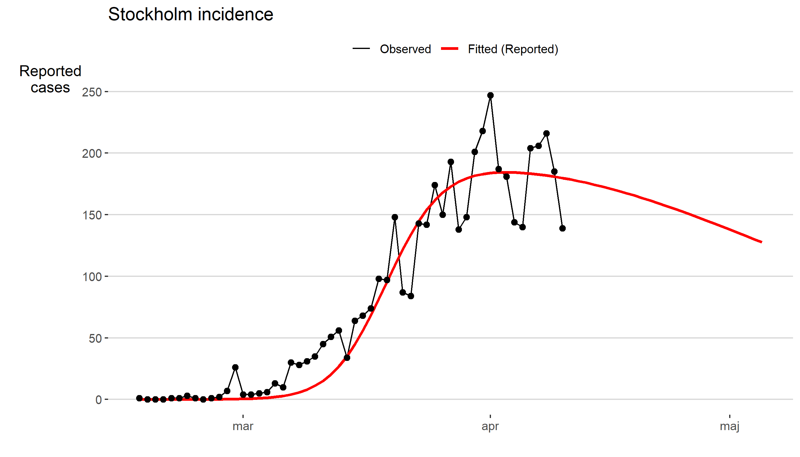
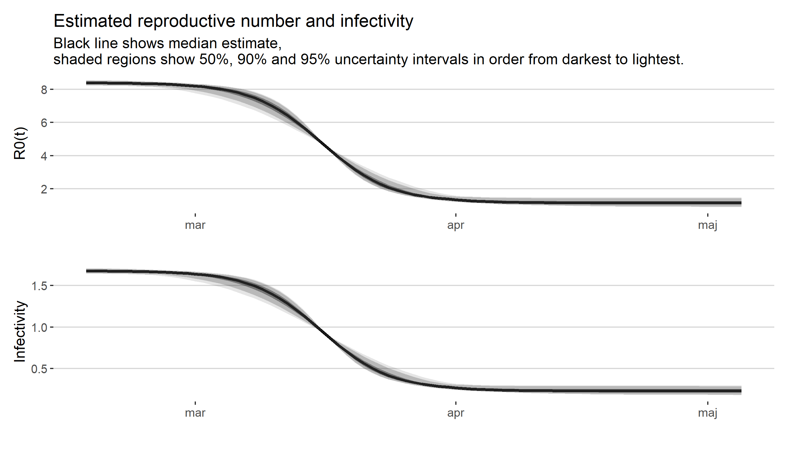
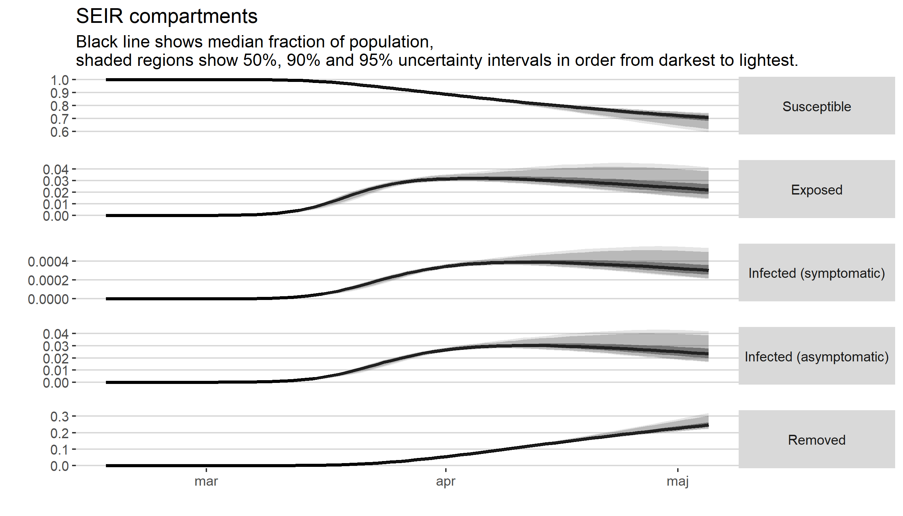

SEIR model Stockholm
================

This repo is a fork of [Folkhälsomyndigheten’s
repo](https://github.com/FohmAnalys/SEIR-model-Stockholm) containing the
code for the SEIR model of the number of Covid-19 cases in Stockholm. I
created this repo to understand their model better, find bugs or
improvements to their code. I list my findings below.

# Summary of changes

## Bugs

  - In the original code, parameters are drawn from a distribution to
    calculate uncertainty estimates. The implicit reason why one can do
    that is that the optimization procedure is a maximum likelihood
    estimation, and such estimators have an asymptotic normal
    distribution. However, this distribution is <i>multivariate</i>
    normal, but the original code draws each parmeter independently from
    each other. The code in this repo fixes this.

## Improvements

  - Parameters are transformed to each lie on the real line before being
    passed to `optim`. This fixes the non-convergence that the original
    code sometimes displayed.
  - Code has been parallelized via the `furrr` package where applicable,
    resulting in a pretty good speedup.
  - Uncertainty estimates are calculated for more quantities, such as
    the infectivity.

## Cosmetic changes

  - Code now uses `tidyverse` packages to a much greater extent.
  - Functions are documented (work in progress).
  - Cleaner variable and function names.
  - Nicer plots via `ggplot2`.

# Model outputs

# Sensitivity analysis

Will explore model sensitivity to parameters `gamma`, `eta` and `p_symp`
here.
